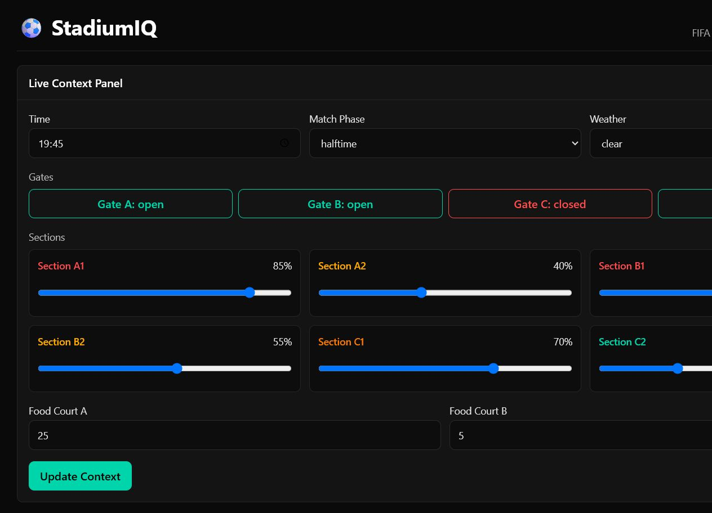
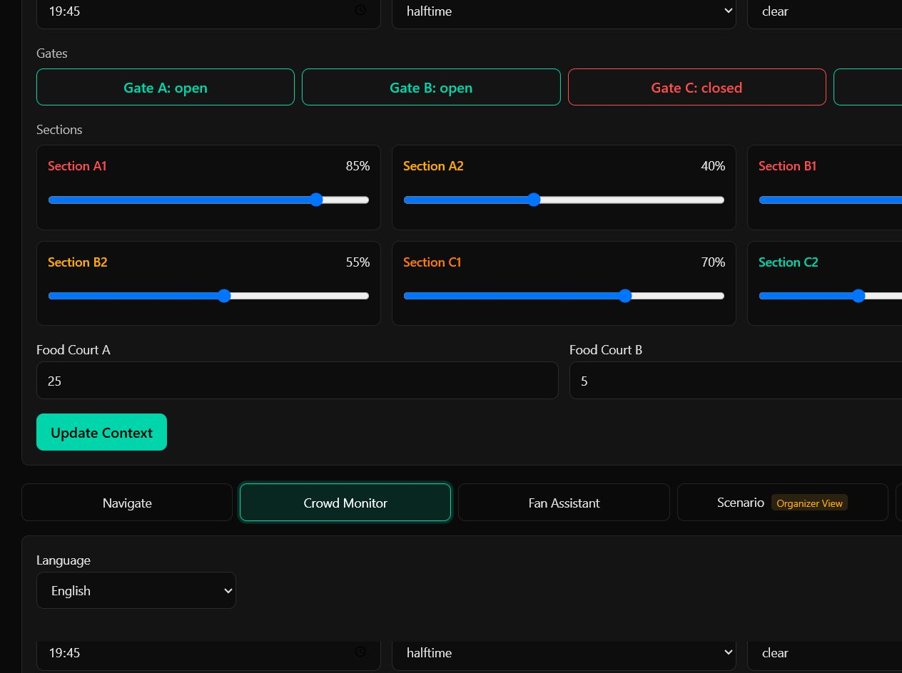
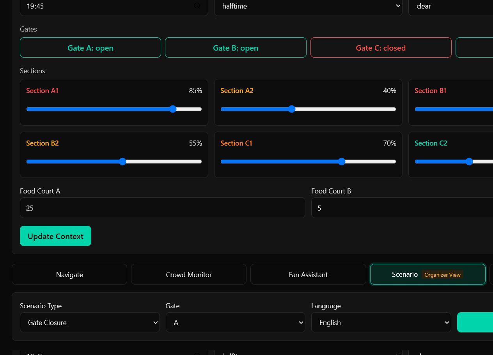

# ⚽ StadiumIQ — Operational Intelligence Platform for FIFA World Cup 2026


**Try the live dashboard here:** [https://stadium-iq-rho.vercel.app/](https://stadium-iq-rho.vercel.app/)

## 🌟 Overview
StadiumIQ is a hybrid AI platform combining deterministic decision engines with Generative AI to optimize stadium operations at FIFA World Cup 2026. It serves fans, venue staff, organizers, and volunteers through intelligent navigation, crowd safety management, multilingual assistance, scenario simulation, and autonomous operational reasoning.

## 🎯 Chosen Vertical
Smart Stadiums & Tournament Operations

## 🧠 Design Principles
- **Deterministic before Generative**: Algorithms compute paths, scores, and impacts. Gemini reasons and communicates — never the reverse.
- **Context-first**: Every AI call includes live stadium state (time, phase, gates, occupancy, queues, weather). No generic responses.
- **Layered architecture**: Engines → Agents → API → UI. Each layer has a single responsibility.
- **Operational, not conversational**: The system behaves like infrastructure, not a chatbot.

## 🏆 Problem Statement Coverage

| PS Requirement | Module | How It's Addressed |
|---|---|---|
| **Smart Navigation** | SmartNav | Dijkstra pathfinding, dynamic congestion avoidance |
| **Crowd Management** | CrowdPulse | Real-time risk scoring, choke-point analysis, concourse pressure |
| **Accessibility** | All modules | Accessibility-aware routing, ARIA labels, semantic HTML UI |
| **Transportation** | Sustainability | Integrates live transit context (Metro vs Parking) for fan recommendations |
| **Multilingual** | FanAssist | Context-aware responses in English, Hindi (Devanagari), and Spanish |
| **Operational Intel** | Operations Copilot | Autonomous priority ranking for venue staff |
| **Real-Time Support** | ScenarioSim + Copilot | What-if simulation, live priority engine with deterministic rules |
| **Sustainability** | Sustainability | Computes carbon impact of rideshare vs public transit based on live queues |

## 👥 User Personas & Operations Mapping
StadiumIQ explicitly serves the four core user groups outlined by the World Cup problem statement:
| Role | Primary Module | Decision Supported |
|---|---|---|
| **Fan / Spectator** | SmartNav, FanAssist | "How do I avoid crowds to find food or get to my seat?" |
| **Volunteer / Steward** | CrowdPulse | "Where should I position myself to relieve concourse pressure?" |
| **Venue Ops Director** | ScenarioSim, Copilot | "If Gate C closes, how many staff do I need to reassign instantly?" |
| **Venue Staff** | Sustainability | "How can we encourage fans to take the Metro while the North lot is full?" |

## 🏗️ Architecture
```text
┌─────────────────────────────────────────────────────────────────┐
│                         Frontend UI                              │
│  Context Panel | SmartNav | CrowdPulse | FanAssist | ScenarioSim │
│                         Operations Copilot                       │
└───────────────────────────────┬─────────────────────────────────┘
                                │ fetch() JSON over HTTP
                                ▼
┌─────────────────────────────────────────────────────────────────┐
│                         FastAPI Backend                          │
│ /navigate | /crowd | /fan | /scenario | /copilot | /stadium-map  │
└───────────────────────────────┬─────────────────────────────────┘
                                │ ContextManager per request
                                ▼
┌─────────────────────────────────────────────────────────────────┐
│                            Agents                                │
│ NavigationAgent | CrowdAgent | FanAssistAgent | ScenarioAgent    │
│ OperationsCopilot                                                │
└───────────────┬───────────────────────────────┬─────────────────┘
                │ deterministic outputs          │ AI explanation
                ▼                               ▼
┌──────────────────────────────┐    ┌─────────────────────────────┐
│            Engines            │    │        Google Gemini         │
│ NavigationGraph + Dijkstra    │    │ gemini-1.5-flash             │
│ CrowdRiskEngine rules         │    │ multilingual reasoning       │
└───────────────┬──────────────┘    └─────────────────────────────┘
                │
                ▼
┌──────────────────────────────┐
│ backend/data/stadium_map.json │
│ 24-node weighted venue graph  │
└──────────────────────────────┘
```

## 🚀 Modules

### 📍 SmartNav (Navigation Agent + Graph Engine)
- Dijkstra's algorithm on a 24-node weighted stadium graph
- Dynamically avoids high-occupancy nodes
- Redirects when destination gate is closed
- Gemini converts computed path to step-by-step directions in EN/HI/ES

### 👥 CrowdPulse (Crowd Agent + Risk Engine)
- Rule-based risk scoring: occupancy + match phase + weather + choke point proximity + queue overflow
- Computes per-section risk (low/medium/high/critical) and concourse pressure
- Gemini explains reasoning and recommends prioritized staff actions

### 🤖 FanAssist (Fan Agent)
- Context-injected Q&A: live queue times, gate status, match phase, transport, accessibility needs
- Recommends shortest food queue, warns on congestion, adapts to accessibility requirements
- Responds in English, Hindi (Devanagari), or Spanish

### ⚡ ScenarioSim (Scenario Agent)
- Simulates gate closure, section overflow, emergency evacuation
- Computes: affected fans, severity, recovery time, required volunteers, alternate routes
- Gemini produces structured operational response plan

### 🧠 Operations Copilot
- Analyzes entire stadium state autonomously
- Ranks top 3 operational priorities with staff assignments and resolution timelines
- Designed for organizers asking: "What should we do right now?"

## ⚙️ How the Solution Works
1. Operator sets live context (time, match phase, gate status, occupancy, queues) in the UI
2. Context is sent in the body of every API call
3. Deterministic engines process data first — paths, scores, impact estimates
4. Gemini receives structured output and provides human-readable reasoning in the chosen language
5. Frontend renders results as visual cards, breadcrumbs, chat, and priority panels

## 🛠️ Tech Stack
| Layer | Technology |
|---|---|
| Backend | Python 3.13, FastAPI, Uvicorn |
| AI | Google Gemini 1.5 Flash |
| Navigation | Custom Dijkstra on adjacency list |
| Risk Engine | Rule-based scoring (pure Python) |
| Frontend | Premium Vanilla HTML/CSS/JS (Glassmorphism) |
| Deployment | Vercel (Serverless Python API + Static UI) |

## 💻 Setup & Run Locally
```bash
git clone https://github.com/pavankarthikeyaatchyuta-lab/Stadium-IQ.git
cd Stadium-IQ
pip install -r requirements.txt
cp .env.example .env
# Edit .env and add your Gemini API key

# Run the FastAPI server
uvicorn backend.main:app --reload --host 0.0.0.0 --port 8000
```
Open `http://localhost:8000/` in your browser to view the dashboard!

## 🧪 Testing & Enterprise Standards
```bash
pytest -v
ruff check .
mypy backend/
# Expected: 39 tests passing, 0 lint errors, 0 type errors
```

**Testing:** AI calls are mocked in tests — deterministic engines are tested against real logic; CI requires no API key.

**Code Quality:** Strict code quality is enforced via CI pipelines.
- **Ruff**: Enforces strict linting standards (pep8 formatting, import sorting, unused variables).
- **Mypy**: Enforces strict static type-checking (`disallow_untyped_defs = true` on core engines) to ensure production-grade reliability.

**Efficiency:** Graph engine is O(E log V) Dijkstra, stateless and thread-safe. Gemini calls are the only external latency; deterministic results are cached at startup and across API responses.
**Security:** Implementation includes SlowAPI rate limiting, strict CORS whitelisting, Cloudflare WAF bypass, and Regex input sanitization.
**Accessibility:** WCAG 2.1 AA contrast compliance, Semantic HTML5, ARIA labels, and full keyboard navigation support.

## 📈 Scalability Considerations
- Graph engine is stateless and thread-safe; scales horizontally
- Context Manager is per-request (no shared mutable state)
- Gemini calls are the only external dependency; can be swapped for local LLM
- Stadium map is JSON-driven; any venue can be onboarded by replacing the file
- Vercel serverless architecture allows infinite on-demand auto-scaling.

## ⚠️ Limitations
- Section occupancy is operator-input (simulates sensor feeds; no real IoT integration)
- Fan count estimates are approximations (500 fans per section unit)
- Hindi output quality depends on Gemini's Devanagari generation capability
- Navigation graph covers MetLife Stadium only

## 🔮 Future Improvements
- Real-time IoT sensor integration for automatic occupancy updates
- Computer vision crowd density estimation from CCTV feeds
- Push notifications to fan mobile app for dynamic rerouting
- Historical data layer for predictive crowd modeling

## 📸 Screenshots
### Live Context + Navigation


### Crowd Monitor


### Scenario Simulator

